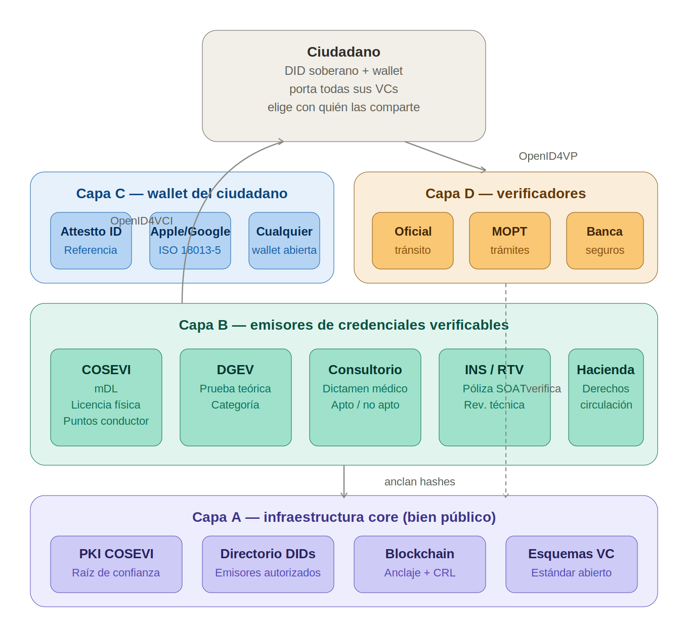

# 1. El Problema: Transparencia Total vs. Privacidad

Las blockchains públicas son transparentes por diseño — cualquier persona puede ver cualquier transacción. Esta propiedad es valiosa para auditoría e integridad, pero crea un problema real cuando los pagos del ecosistema se procesan on-chain:

- **Personas:** Un ciudadano que paga su renovación de licencia no debería revelar su saldo completo ni su historial financiero a nadie
- **Comercios:** Un negocio que acepta pagos digitales no debería exponer sus volúmenes de venta ni su base de clientes a competidores
- **Instituciones:** Una entidad que procesa miles de pagos diarios no debería exponer los montos individuales al público

Esto no se trata solo del gobierno. Se trata de proteger a **todas las partes** — personas, comercios e instituciones — en un ecosistema donde cualquiera puede participar.

## La pregunta correcta

No es: "¿blockchain o privacidad?"

Es: **¿cómo lograr que las transacciones sean privadas para el público pero auditables por el regulador competente, y al mismo tiempo permitan la interoperabilidad entre instituciones, empresas e individuos?**

## Dos objetivos, no uno

1. **Privacidad:** Proteger al ciudadano, al comercio y a la institución de la vigilancia innecesaria, manteniendo intacta la capacidad del Estado de supervisar cuando tiene causa legítima.

2. **Interoperabilidad:** Permitir que instituciones, empresas e individuos transaccionen entre sí a través de rieles abiertos — sin intermediarios propietarios, sin acuerdos bilaterales, sin horarios restringidos.

La respuesta técnica existe y opera en tres capas complementarias.

