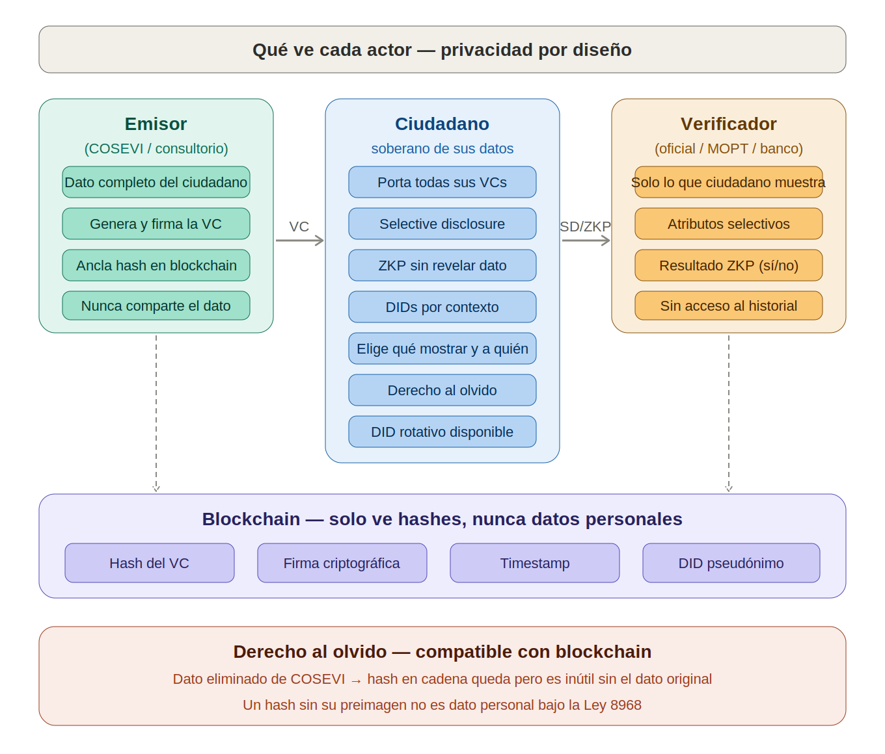

# 2. Capa 1 — Transferencias Confidenciales (Token-2022)

## Qué es

Solana Token-2022 incluye una extensión nativa llamada **Confidential Transfers** que cifra los montos de las transacciones directamente en el protocolo. El monto viaja cifrado; solo el emisor, el receptor y los auditores autorizados pueden descifrarlo.

## Cómo funciona

```
Transacción estándar (hoy):
  Alice → Bob: 13,000 CRC    ← visible para todo el mundo

Transacción confidencial (Token-2022):
  Alice → Bob: [ciphertext]   ← el monto está cifrado

  Quién puede ver el monto:
  ✓ Alice (emisora)
  ✓ Bob (receptor)
  ✓ Auditor autorizado (con clave de auditoría)
  ✗ Cualquier otra persona
```

## Propiedades criptográficas

- **Cifrado homomórfico (Twisted ElGamal):** permite verificar que la suma de entradas = suma de salidas sin descifrar los montos. La cadena valida la integridad matemática de la transacción sin conocer los valores.
- **Range proofs (Bulletproofs):** prueban que los montos son positivos y están dentro de un rango válido, sin revelarlos. Esto previene la creación de tokens de la nada.
- **Auditor key:** una clave pública designada que puede descifrar todos los montos. El titular de esta clave es el regulador financiero.

## Aplicación al ecosistema

| Transacción | Qué se cifra | Quién ve el monto |
|---|---|---|
| Ciudadano paga renovación de licencia | Monto | Ciudadano, COSEVI, SUGEF |
| COSEVI distribuye fee al proveedor | Monto del split | COSEVI, proveedor, SUGEF |
| Ciudadano paga multa (en banco o sitio web) | Monto | Ciudadano, banco/sitio, SUGEF |
| Pago de marchamo | Monto | Ciudadano, Hacienda, SUGEF |
| Comercio acepta pago con stablecoin | Monto | Comercio, cliente, SUGEF |

El público puede ver **que** ocurrió una transacción (timestamp, participantes pseudónimos), pero **no cuánto** se pagó.


