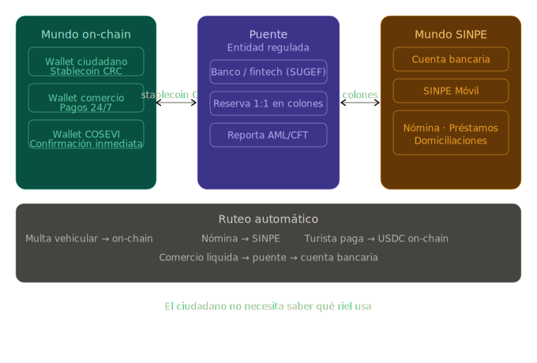

# 6. Compatibilidad con SINPE

La infraestructura actual de SINPE opera sobre servicios SOAP/WCF con certificados PKI de la jerarquía nacional (CA RAIZ NACIONAL → CA POLITICA PERSONA JURIDICA → CA SINPE). Las transacciones SINPE siguen un patrón de Two-Phase Commit y requieren respuesta en menos de 6 segundos.

Los rieles de pago on-chain **no reemplazan a SINPE** — operan como una capa complementaria:

| Aspecto | SINPE (actual) | Rieles on-chain (complementario) |
|---|---|---|
| **Protocolo** | SOAP/WCF sobre TLS 1.2 | Transacciones blockchain nativas |
| **Privacidad** | La entidad ve todos los datos del cliente | Montos cifrados, wallets pseudónimos |
| **Velocidad** | <6 segundos (requisito BCCR) | Segundos (finalidad Solana ~400ms + preflight + API call del cliente) |
| **Auditoría** | Logs internos de cada entidad | Auditor key + ZKP de lote + registro inmutable |
| **Interoperabilidad** | Bilateral (cada entidad implementa WCF/WS) | Abierta (cualquier actor con SDK estándar) |
| **Costo por transacción** | Definido por BCCR + intermediario | $0.00025-$0.001 (fee base Solana) |
| **Horario** | Horario SINPE | 24/7/365 |
| **Alcance** | Nacional (entidades supervisadas) | Global (cualquier participante) |

## Ruteo automático

El ciudadano no elige entre uno u otro — el sistema rutea automáticamente según el tipo de transacción:

- **Pagos institucionales del ecosistema vial** (renovaciones, multas, marchamo): rieles on-chain con privacidad
- **Transferencias bancarias tradicionales** (nómina, préstamos): SINPE como siempre
- **Pagos cross-border** (turista que paga multa, verificación internacional): USDC/stablecoins via rieles on-chain
- **Comercios que aceptan stablecoins**: rieles on-chain directos, sin intermediario
