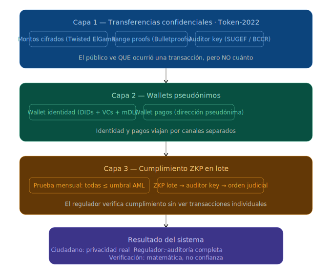

# 8. Resumen: Tres Capas, Dos Objetivos



```
  PRIVACIDAD TRANSACCIONAL

  Capa 1: Transferencias Confidenciales (Token-2022)
  → Montos cifrados en el protocolo
  → Solo emisor, receptor y auditor ven el monto

  Capa 2: Wallets Pseudónimos
  → Identidad separada de pagos
  → Vinculación distribuida (tenant conoce a sus clientes)
  → Acceso regulatorio solo por orden formal

  Capa 3: Cumplimiento ZKP en Lote
  → Pruebas de cumplimiento AML/CFT sin datos individuales
  → Escalamiento progresivo de acceso

  Objetivo 1 — Privacidad:
  • Personas, comercios e instituciones protegidos
  • El regulador tiene capacidad de auditoría completa
  • Nadie más tiene acceso a datos que no le corresponden
  • Todo verificable matemáticamente, no por confianza

  Objetivo 2 — Interoperabilidad:
  • Instituciones, empresas e individuos transaccionan
    a través de rieles abiertos
  • Sin intermediarios propietarios
  • Sin acuerdos bilaterales
  • Sin horarios restringidos
  • Complementario a SINPE, no sustituto
```
