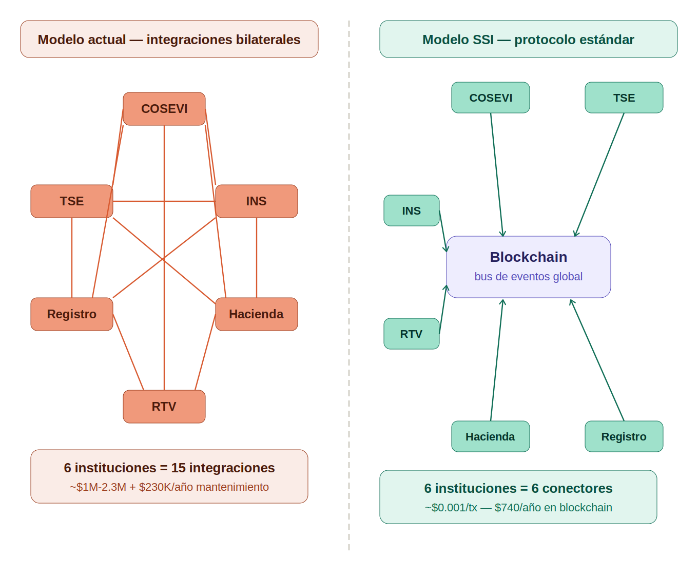

# 10. Más Allá del Ecosistema Vial



## Lo que este documento demuestra

Las secciones anteriores presentan la arquitectura de privacidad transaccional en el contexto del ecosistema vial — multas, licencias, marchamo. Este es el caso de uso inmediato porque COSEVI/MOPT ya tiene la necesidad y el marco institucional para implementarlo.

Pero la infraestructura que se describe aquí **no es específica del ecosistema vial**. Es infraestructura pública de propósito general.

## La misma arquitectura, cualquier dominio

```
  Lo que construimos para COSEVI        Lo que habilita para el país
  ──────────────────────────────        ──────────────────────────────

  Credencial verificable de licencia    Credencial verificable de CUALQUIER documento
  (mDL)                                 • Título profesional (CONESUP)
                                        • Póliza de salud (CCSS)
                                        • Permiso de operación (municipalidad)
                                        • Certificación tributaria (Hacienda)
                                        • Personería jurídica (Registro Nacional)

  Pago de multa con privacidad          Pago de CUALQUIER servicio público
                                        • Servicios municipales
                                        • Timbres fiscales
                                        • Cuotas CCSS
                                        • Impuestos municipales
                                        • Tasas registrales

  Wallet pseudónimo del ciudadano       Identidad digital portable del ciudadano
                                        • Un DID, múltiples credenciales
                                        • El ciudadano controla qué comparte y con quién
                                        • No depende de una sola institución

  Auditor key para SUGEF/BCCR           Gobernanza distribuida para CUALQUIER regulador
                                        • Contraloría: verificación de fondos públicos
                                        • SUGEF: cumplimiento AML/CFT
                                        • Hacienda: trazabilidad fiscal
                                        • Cada regulador ve solo lo que le compete
```

## El patrón es el mismo

Cada dominio del Estado tiene el mismo problema:

1. **Ciudadanos** que necesitan demostrar algo (identidad, estado, cumplimiento) sin exponer más de lo necesario
2. **Instituciones** que necesitan verificar ese algo sin mantener bases de datos propias de cada ciudadano
3. **Reguladores** que necesitan supervisar sin tener acceso total a los datos de todos

El ecosistema vial es donde se demuestra que funciona. Una pregunta natural que surge es: **¿por qué cada institución del Estado construiría su propia infraestructura de identidad y pagos si puede conectarse a una que ya existe?**

## Los rieles financieros como dominio adyacente

La privacidad transaccional que se describe en este documento aplica directamente al dominio financiero — un dominio donde Costa Rica ya tiene señales claras de que la infraestructura actual no es suficiente:

**SUGEF ya mandó shared KYC centralizado (CICAC, Resolución SGF-2317-2021)**
Todas las entidades financieras principales recibieron la orden de participar en un piloto de base de datos centralizada para "conozca a su cliente." La intención es correcta — eliminar duplicidad, mejorar cumplimiento. Pero el modelo centralizado crea un punto único de fallo y un blanco de alto valor para ataques.

Las credenciales verificables logran lo mismo sin centralizar: cada entidad verifica al cliente contra una credencial emitida por la fuente autoritativa (TSE para identidad, Registro Nacional para personería, SUGEF para historial crediticio) — sin que ninguna base de datos central contenga toda la información de todos los clientes.

**Las amenazas cibernéticas recientes refuerzan la importancia de arquitecturas distribuidas**
Cuando la infraestructura depende de servidores centrales con acceso a datos sensibles, la superficie de ataque se concentra. Una arquitectura donde las credenciales son portables y verificables criptográficamente reduce esa superficie — la verificación es matemática, no basada en consultas a bases de datos centralizadas.

**SINPE es excelente para lo que fue diseñado — y esta infraestructura lo complementa**
SINPE opera sobre SOAP/WCF con certificados PKI y patrones Two-Phase Commit. Cumple su función de manera confiable. La infraestructura descrita aquí no busca reemplazarlo sino extender el alcance del ecosistema de pagos hacia casos que SINPE no fue diseñado para cubrir: pagos programables, horarios 24/7, e interoperabilidad con actores fuera del sistema bancario formal.

**El 78% de pequeños propietarios fueron los más afectados por la pandemia**
(Estado de la Nación, 2021). Estos son los actores que más necesitan acceso a rieles modernos de pago y verificación de identidad — y son los que menos pueden pagar las barreras de entrada actuales (cuenta bancaria + inscripción Hacienda + contrato con adquirente + datafono físico).

## Lo que esta arquitectura habilita

Esta infraestructura no reemplaza nada existente. Habilita una capa de **infraestructura pública digital abierta** — complementaria a lo que ya opera — que cualquier institución, empresa o ciudadano puede usar:

```
  Infraestructura actual (funciona, se mantiene)
  ───────────────────────────────────────────────
  SINPE          → Transferencias bancarias, nómina, domiciliaciones
  Firma digital  → Certificados PKI, firma de documentos legales
  CIC/CICAC      → Historial crediticio, shared KYC centralizado
  TSE            → Padrón electoral, identificación civil

  Infraestructura complementaria (lo que se agrega)
  ─────────────────────────────────────────────────
  DIDs + VCs     → Identidad verificable portable, sin dependencia institucional
  Token-2022     → Pagos con privacidad, rieles abiertos 24/7
  ZKP            → Cumplimiento regulatorio sin vigilancia masiva
  Gobernanza     → Multisig distribuida, sin punto único de control
```

Cada institución decide cuándo y cómo conectarse. No hay migración forzada. No hay dependencia de un proveedor. El estándar es abierto, la infraestructura es pública, y la gobernanza es distribuida.

## El rol de MICITT en esta visión

MICITT ya cumple el rol de **supervisor técnico y garante de estándares** en el ecosistema digital costarricense. Esta infraestructura se alinea con ese mandato: asegurar que los sistemas cumplen normas, son interoperables, y no crean dependencias propietarias.

Lo que cambia no es el rol — es el alcance de lo que se puede supervisar cuando la infraestructura lo permite.

## Un espacio natural de colaboración

El Centro de Innovación Financiera (CIF) tiene como mandato explorar exactamente este tipo de infraestructura. Los rieles financieros abiertos, la identidad digital verificable, y el cumplimiento regulatorio programable no son ideas teóricas — son tecnología operativa que ya se demuestra en el ecosistema vial.

El ecosistema vial funciona como prueba de concepto. La misma infraestructura puede servir al sistema financiero, al sistema de salud, al sistema registral, y a cualquier otro dominio donde el Estado necesita que los ciudadanos demuestren cosas sin perder su privacidad. La colaboración entre MICITT, las instituciones sectoriales, y los actores técnicos es lo que convierte esa posibilidad en realidad.
