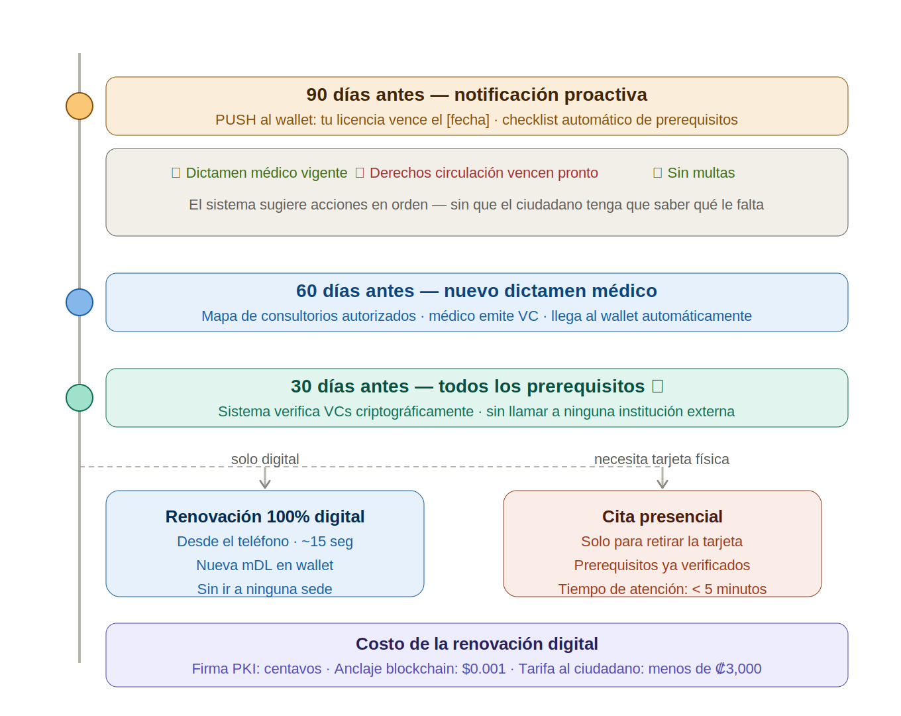
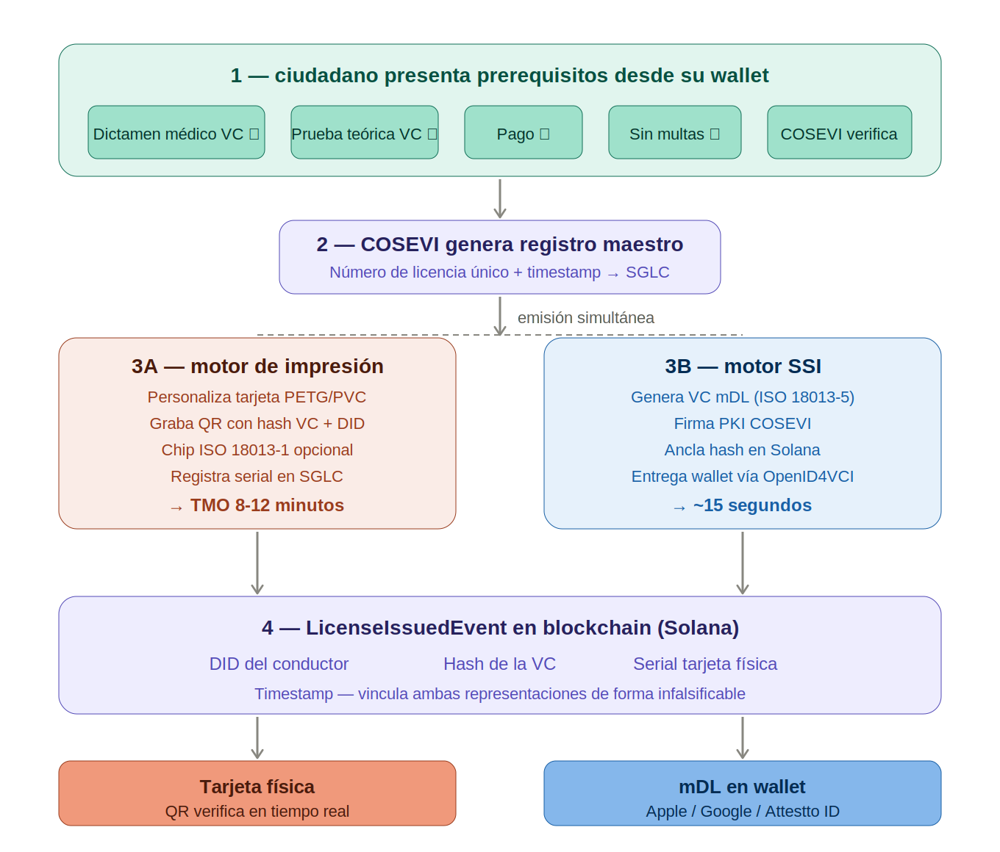

# 11. Experiencia del Ciudadano — Flujos de Uso Real

## Por qué importa el costo

La licitación actual establece una tarifa de ₡13,000 por emisión de licencia. Este monto incluye el plástico físico, la logística de entrega, y las comisiones de procesamiento de pago por tarjeta o transferencia.

Con una arquitectura de rieles abiertos, la estructura de costos cambia:

```
  Modelo actual (licitación)
  ──────────────────────────
  Tarifa total:                    ₡13,000
  Incluye:
    • Plástico físico + impresión
    • Logística de entrega
    • Comisión de pago (3-7% tarjeta)
    • Margen del proveedor único

  Modelo con rieles abiertos
  ──────────────────────────
  Renovación digital (sin plástico): ₡500–1,000
  Incluye:
    • Emisión de credencial verificable
    • Fee de red (<₡1)
    • Distribución automática a COSEVI + proveedor + infraestructura

  Primera emisión (con plástico):    ₡3,000–5,000
  Incluye:
    • Todo lo anterior
    • Producción y envío del plástico físico
```

La diferencia no es teórica. Son ₡12,000 menos por renovación digital para cada ciudadano. Con 523,000 emisiones anuales, el ahorro colectivo es significativo — y el ciudadano recibe un servicio más rápido.

---



## Flujo 1: María renueva su licencia

María tiene 34 años, vive en Heredia. Su licencia vence en 2 semanas.

### Hoy

1. María va al sitio web del banco o a una sucursal
2. Busca el servicio de COSEVI, ingresa su cédula
3. Paga ₡13,000 con tarjeta de débito (comisión incluida)
4. Espera confirmación del banco → COSEVI procesa → correo de confirmación
5. Recibe el plástico por correo días o semanas después
6. Si pierde el plástico, repite todo el proceso

### Con credencial verificable + rieles abiertos

```
  1. María recibe notificación en su celular
     "Tu licencia vence en 14 días. ¿Renovar ahora?"
     → Toca "Renovar"

  2. El sistema verifica automáticamente
     → Licencia vigente: sí
     → Multas pendientes: no
     → Restricciones médicas: ninguna actualización requerida
     → Todo se verifica contra credenciales existentes, no contra bases de datos

  3. María confirma el pago
     → ₡500 desde su wallet o app del banco
     → El monto está cifrado (solo María, COSEVI y el auditor lo ven)
     → La distribución es automática: COSEVI recibe su parte, el proveedor la suya

  4. Credencial renovada en segundos
     → La nueva mDL aparece en su wallet inmediatamente
     → Tiene validez legal desde ese momento
     → Si necesita el plástico, lo solicita aparte (₡2,500 adicionales, envío a domicilio)

  5. María usa su mDL
     → En un control de tránsito: el oficial escanea un código, ve que la licencia es válida
     → En un rent-a-car: presenta el código, la empresa verifica sin ver más datos de los necesarios
     → Si pierde el celular: recupera sus credenciales desde su respaldo, no necesita volver a COSEVI
```



### Qué cambió para María

| Aspecto | Hoy | Con rieles abiertos |
|---|---|---|
| Costo | ₡13,000 | ₡500 (digital) o ₡3,000 (con plástico) |
| Tiempo | Días a semanas | Segundos |
| Dónde | Sitio web del banco o sucursal | Desde su celular, cualquier hora |
| Comprobante | PDF o papel | Credencial verificable en su wallet |
| Si pierde el documento | Repetir todo el proceso | Recuperar desde respaldo |
| Privacidad | El banco ve todo | Solo las partes involucradas |

---

## Flujo 2: Carlos recibe una multa de tránsito

Carlos tiene 28 años, maneja en San José. Un oficial lo detiene por exceso de velocidad.

### Hoy

1. El oficial emite un parte (papel o sistema interno)
2. Carlos recibe notificación de que tiene una multa pendiente
3. Va al banco o sitio web, busca la multa por número de cédula
4. Paga con tarjeta. El banco cobra comisión.
5. COSEVI confirma el pago días después
6. Si Carlos quiere impugnar, el proceso es separado y manual

### Con credencial verificable + rieles abiertos

```
  1. El oficial registra la infracción
     → Escanea la mDL de Carlos (código QR o NFC)
     → El sistema verifica: licencia válida, tipo correcto, sin restricciones
     → Se genera un registro de infracción vinculado a la credencial
     → Carlos recibe notificación inmediata en su wallet

  2. Carlos revisa la multa
     → Ve el detalle: tipo de infracción, monto, fecha, ubicación
     → Opción 1: Pagar ahora
     → Opción 2: Impugnar (genera solicitud formal automáticamente)

  3. Carlos decide pagar
     → ₡68,000 (multa por exceso de velocidad, según tabla COSEVI)
     → Paga desde su wallet o app del banco
     → Transacción confidencial: el monto está cifrado
     → COSEVI recibe confirmación inmediata

  4. Registro actualizado
     → La multa se marca como pagada en tiempo real
     → Carlos recibe comprobante verificable (VC de pago)
     → Si un oficial lo detiene de nuevo, puede verificar que no tiene multas pendientes
     → No necesita llevar papeles ni comprobantes bancarios
```

### Qué cambió para Carlos

| Aspecto | Hoy | Con rieles abiertos |
|---|---|---|
| Notificación | Días después | Inmediata |
| Pago | Sitio web del banco, horario bancario | Desde el celular, 24/7 |
| Confirmación | Días (conciliación) | Segundos |
| Comprobante | PDF o papel | VC verificable |
| Verificación posterior | Llevar papel o consultar sitio web | El oficial lo verifica al instante |

---

## Flujo 3: Turista alquila auto y necesita verificar su licencia

Sarah es canadiense, llega a Liberia para vacaciones. Quiere alquilar un auto.

### Hoy

1. Sarah presenta su licencia canadiense física en el rent-a-car
2. El empleado la fotocopia (dato personal almacenado sin control)
3. No hay verificación real — el empleado confía en el aspecto del documento
4. Si la licencia está vencida o restringida en Canadá, nadie lo sabe
5. En caso de accidente, la aseguradora cuestiona la validez de la licencia

### Con credencial verificable

```
  1. Sarah tiene su mDL canadiense en formato digital
     → Emitida por la provincia canadiense correspondiente
     → Formato ISO 18013-5 (estándar internacional de mDL)

  2. En el rent-a-car, presenta su credencial
     → Escanea código QR o toca NFC
     → El sistema verifica:
       • La credencial es auténtica (firma del emisor canadiense)
       • No está vencida
       • La categoría permite vehículos de pasajeros
     → Verificación criptográfica, no visual

  3. El rent-a-car recibe solo lo necesario
     → Nombre, categoría de licencia, fecha de vencimiento
     → NO recibe: dirección, número de seguro social, historial de infracciones
     → Divulgación selectiva: Sarah controla qué datos comparte

  4. En caso de incidente
     → La aseguradora puede verificar que la licencia era válida al momento del alquiler
     → El comprobante de verificación es una VC, no una fotocopia
     → La cadena de verificación es auditable
```

### Qué cambió para Sarah (y para el rent-a-car)

| Aspecto | Hoy | Con credencial verificable |
|---|---|---|
| Verificación | Visual (el empleado "confía") | Criptográfica (matemáticamente verificable) |
| Datos compartidos | Fotocopia completa del documento | Solo los campos necesarios |
| Validez real | No se verifica contra el emisor | Se verifica firma + vigencia + categoría |
| Almacenamiento | Fotocopia en archivo del rent-a-car | Comprobante de verificación (sin datos personales almacenados) |
| Para la aseguradora | Fotocopia que puede ser cuestionada | VC verificable con timestamp |

---

## Flujo 4: Doña Carmen, 67 años, renueva en zona rural

Doña Carmen vive en Nicoya. No tiene tarjeta de crédito. Su banco más cercano está a 30 minutos.

### Hoy

1. Doña Carmen viaja al banco en Nicoya (30 min, ₡2,000 en bus)
2. Hace fila para pagar ₡13,000 por la renovación
3. Espera el plástico por correo (si llega — el correo en zonas rurales es inconsistente)
4. Si hay un error, tiene que volver al banco

### Con rieles abiertos

```
  1. Doña Carmen va a la pulpería del pueblo
     → La pulpería tiene un agente corresponsal (modelo ya existente en CR)
     → Deposita ₡500 en efectivo
     → El agente le carga el monto a su wallet básico (sin cuenta bancaria)

  2. Desde su celular (o el del agente)
     → Inicia renovación
     → El sistema verifica todo automáticamente
     → Paga los ₡500

  3. Credencial renovada
     → La mDL está en su celular
     → Si no tiene smartphone, puede obtener un código QR impreso
       que funciona como comprobante verificable

  4. Sin viaje al banco
     → Ahorro: ₡2,000 en transporte + medio día de tiempo
     → No depende del correo para recibir el plástico
     → Si necesita el plástico, lo solicita y le llega por correo — pero no lo necesita para que la licencia sea válida
```

### Por qué este flujo importa

Nicoya tiene 54,000 habitantes. Guanacaste tiene municipalidades donde el banco más cercano está a 45 minutos. La brecha territorial que documenta el Estado de la Nación (Chorotega: -12.3% en actividad económica durante la pandemia) se agrava cuando los servicios públicos requieren presencia física y acceso bancario.

Los rieles abiertos no son solo tecnología. Son acceso.

---

## Lo que tienen en común estos flujos

Todos los flujos anteriores comparten la misma arquitectura:

1. **Credencial verificable** — el documento es una VC estándar, verificable por cualquier parte autorizada
2. **Pago con privacidad** — el monto está cifrado, solo las partes involucradas lo ven
3. **Sin intermediario obligatorio** — el ciudadano no depende de un solo banco o proveedor
4. **Verificación instantánea** — segundos, no días
5. **Costo proporcional al servicio** — ₡500 por una renovación digital, no ₡13,000

La infraestructura es la misma para María en Heredia, Carlos en San José, Sarah de Canadá, y Doña Carmen en Nicoya. La diferencia es el canal de acceso — no la arquitectura.
