# 12. Distribución de Fees — Modelo Ilustrativo



## Principio

La distribución de fees no es un detalle de implementación — es lo que determina si el ecosistema crece o se estanca. Un modelo bien diseñado alinea los incentivos de todos los actores: la institución, el proveedor, el ciudadano, y los futuros participantes que aún no existen.

## Ejemplo: Renovación digital de licencia (₡1,000)

```
  Ciudadano paga ₡1,000 por renovar su licencia digital

  El contrato inteligente distribuye atómicamente:

  ₡400 (40%)  →  COSEVI (institución reguladora)
                  Ingreso directo, sin intermediario bancario.
                  Confirmación inmediata, no T+30.

  ₡300 (30%)  →  Proveedor de interfaz (la app que usó el ciudadano)
                  Puede ser la app de un banco, una fintech, o un desarrollador
                  independiente que integró el SDK.
                  Múltiples proveedores compiten por ofrecer la mejor experiencia.

  ₡150 (15%)  →  Operador de infraestructura
                  Quien mantiene los nodos, SDKs, esquemas de credenciales,
                  y la infraestructura de verificación.

  ₡100 (10%)  →  Fondo de ecosistema
                  Financia nuevas integraciones, auditorías de seguridad,
                  y proyectos que amplíen el alcance del ecosistema.

  ₡50  (5%)   →  Reserva de mantenimiento
                  Actualizaciones de protocolo, compatibilidad con nuevos
                  estándares, soporte de largo plazo.
```

Todas las partes reciben su porción en la **misma transacción**. No hay facturación posterior, no hay conciliación mensual, no hay disputas sobre montos.

## Comparación con el modelo actual

| Aspecto | Modelo actual (₡13,000) | Modelo abierto (₡1,000) |
|---|---|---|
| Tarifa al ciudadano | ₡13,000 | ₡1,000 (digital) / ₡3,000-5,000 (con plástico) |
| Ingreso para COSEVI | Depende del contrato con el proveedor | ₡400 directos, confirmados al instante |
| Proveedores | Uno solo (adjudicatario) | Cualquiera que integre el SDK |
| Comisión de pago | 3-7% (tarjeta) | <0.1% (fee de red) |
| Conciliación | Mensual, manual | Automática, en cada transacción |
| Transparencia | Reportes del proveedor | Verificable on-chain por cualquier auditor |
| Incentivo para innovar | Ninguno (monopolio) | 30% va al proveedor que mejor sirva al ciudadano |

## El fondo de ecosistema

El 10% destinado al fondo de ecosistema es lo que hace que la infraestructura crezca más allá del caso de uso inicial. Este fondo puede financiar:

### Nuevas integraciones institucionales

```
  Ejemplo: Una municipalidad quiere emitir permisos de construcción
  como credenciales verificables usando la misma infraestructura.

  El fondo cubre:
  → Desarrollo del esquema de credencial para permisos
  → Integración técnica con el sistema municipal
  → Auditoría de seguridad del nuevo flujo
  → Documentación y capacitación

  Resultado: una institución más conectada al ecosistema,
  sin que COSEVI ni el ciudadano paguen más.
```

### Proveedores de interfaz emergentes

```
  Ejemplo: Un equipo de desarrolladores en Limón quiere crear
  una app de servicios vehiculares enfocada en la zona Caribe.

  El fondo cubre:
  → Acceso al SDK y documentación
  → Soporte técnico durante la integración
  → Auditoría de seguridad antes del lanzamiento

  Resultado: un nuevo proveedor que compite en calidad,
  atendiendo una zona que hoy está desatendida.
  Cada renovación que procese le genera 30% — se autofinancia.
```

### Auditorías y seguridad

```
  Ejemplo: Auditoría anual de los contratos inteligentes
  y la infraestructura criptográfica.

  El fondo cubre:
  → Firma de auditoría especializada
  → Pruebas de penetración
  → Revisión de cumplimiento normativo

  Resultado: confianza verificable para todas las partes,
  sin que una sola institución cargue con el costo.
```

### Investigación y estándares

```
  Ejemplo: Participación en el proceso de estandarización
  de mDL a nivel regional (ISO 18013-5, ICAO).

  El fondo cubre:
  → Representación en comités técnicos
  → Desarrollo de compatibilidad con estándares emergentes
  → Documentación pública de las decisiones de diseño

  Resultado: Costa Rica no solo adopta estándares — contribuye a definirlos.
```

## Gobernanza del fondo

El fondo no es discrecional. Su uso se decide por el mismo mecanismo de gobernanza multisig que administra los parámetros del ecosistema:

```
  Propuesta de uso de fondos
       ↓
  Revisión por comité técnico (COSEVI + MICITT + operador)
       ↓
  Aprobación multisig 2-of-3
       ↓
  Ejecución on-chain (transparente, auditable)
       ↓
  Reporte público de uso de fondos
```

Cualquier ciudadano o institución puede proponer proyectos. La aprobación requiere consenso del multisig. Los fondos se desembolsan contra entregables verificables, no contra promesas.

## Escala

A 523,000 renovaciones anuales con una tarifa de ₡1,000:

| Componente | Monto anual | Uso |
|---|---|---|
| COSEVI | ₡209M (~$400K) | Ingreso institucional directo |
| Proveedores de interfaz | ₡157M (~$300K) | Distribuido entre todos los que compiten |
| Infraestructura | ₡78M (~$150K) | Mantenimiento y operación |
| **Fondo de ecosistema** | **₡52M (~$100K)** | Nuevas integraciones, auditorías, investigación |
| Reserva | ₡26M (~$50K) | Actualizaciones de largo plazo |

Con ₡52M anuales (~$100K), el fondo puede financiar 3-5 integraciones nuevas por año, auditorías semestrales, y participación en estándares internacionales. A medida que más instituciones se conectan y las transacciones crecen, el fondo crece proporcionalmente — sin aumentar la tarifa al ciudadano.

## Nota sobre los porcentajes

Los porcentajes presentados aquí son **ilustrativos**. Los valores finales se definen mediante el mecanismo de gobernanza del ecosistema, con participación de las instituciones involucradas. Lo que esta sección demuestra es el modelo — no los números exactos.

Lo que sí es estructural:
- La distribución es automática y atómica (contrato inteligente)
- Existe un fondo de ecosistema que financia el crecimiento
- Los porcentajes son modificables por gobernanza, no hardcodeados
- Cualquier cambio requiere aprobación multisig
