# 13. Modelo de Financiamiento — ¿Quién Paga?



## La pregunta

Toda infraestructura tiene un costo. La pregunta legítima es: si esta arquitectura no requiere una licitación tradicional ni un contrato de concesión, ¿quién financia su desarrollo, operación y mantenimiento?

## La respuesta corta

El Estado no financia la infraestructura. Se conecta a ella.

## Cómo se financia cada componente

### 1. Código abierto (schemas, SDKs, especificaciones DID, resolver)

```
  Quién lo construye:   Desarrolladores del ecosistema y comunidad open source
  Quién lo financia:    El operador de infraestructura (a través de su operación comercial)
  Costo para el Estado: Cero
  Licencia:             Open source — cualquiera puede usar, auditar y contribuir
```

El código de infraestructura — los esquemas de credenciales, las especificaciones del método DID, los SDKs de integración, el resolver — es público y abierto. Está disponible hoy. No requiere contrato, licitación ni presupuesto público.

Este modelo es análogo a cómo operan los estándares web: nadie paga por usar HTML, HTTP o TLS. Las empresas que construyen sobre esos estándares financian su desarrollo.

### 2. Auditoría de programas on-chain

```
  Quién lo audita:      Firmas especializadas en seguridad de contratos inteligentes
  Quién lo financia:    Solana Foundation (programa de grants para infraestructura)
  Costo para el Estado: Cero
```

Las fundaciones de ecosistemas blockchain financian activamente la auditoría de infraestructura pública construida sobre sus redes. Solana Foundation tiene programas de grants específicos para proyectos de infraestructura de identidad y pagos. La auditoría de los contratos inteligentes del ecosistema vial califica directamente para este tipo de financiamiento.

### 3. Integración institucional (COSEVI, municipalidades, otras instituciones)

```
  Quién lo construye:   Proveedores técnicos (pueden ser múltiples, compitiendo)
  Quién lo financia:    El fondo de ecosistema (10% de cada transacción)
  Costo para el Estado: Cero en infraestructura — la institución conecta sus sistemas existentes
```

El fondo de ecosistema descrito en la sección anterior genera ~₡52M anuales (~$100K) solo del caso vehicular. Este fondo cubre:
- Desarrollo de nuevos esquemas de credenciales para cada institución
- Soporte técnico para la integración
- Auditorías de seguridad de cada nuevo flujo

A medida que más instituciones se conectan, el volumen de transacciones crece y el fondo crece proporcionalmente — sin aumentar costos para nadie.

### 4. Puente SINPE (on-ramp/off-ramp entre stablecoins y colones)

```
  Quién lo opera:       Una entidad financiera regulada (banco o fintech)
  Quién lo financia:    La entidad misma — es su modelo de negocio
  Costo para el Estado: Cero
```

El puente entre el mundo on-chain y el sistema bancario es operado por una entidad supervisada por SUGEF. Esta entidad gana un margen por cada conversión stablecoin ↔ colones — es un negocio viable para cualquier banco que quiera participar. No requiere inversión pública.

### 5. Operación y mantenimiento de infraestructura

```
  Quién lo opera:       Operador de infraestructura (cualquier proveedor calificado)
  Quién lo financia:    15% de cada transacción (distribución automática)
  Costo para el Estado: Cero
```

La operación de nodos, mantenimiento de SDKs, actualización de esquemas, y soporte técnico se financia directamente desde el flujo de transacciones. No hay contrato de mantenimiento separado — el operador recibe su porción automáticamente por cada transacción procesada.

### 6. Supervisión y gobernanza (MICITT)

```
  Quién supervisa:      MICITT (en su rol existente)
  Quién lo financia:    Presupuesto ordinario de MICITT (no requiere presupuesto adicional)
  Costo adicional:      Cero — es parte del mandato existente de supervisión técnica
```

MICITT no construye ni opera infraestructura nueva. Supervisa que la infraestructura existente cumpla estándares — función que ya realiza para otros sistemas digitales del Estado.

## Resumen: flujo de financiamiento

```
  Ciudadano paga ₡1,000 por renovar licencia
       │
       ├──→ ₡400  COSEVI (ingreso institucional)
       ├──→ ₡300  Proveedor de interfaz (se autofinancia)
       ├──→ ₡150  Operador de infraestructura (se autofinancia)
       ├──→ ₡100  Fondo de ecosistema (financia crecimiento)
       └──→ ₡50   Reserva de mantenimiento (financia largo plazo)

  Código open source         ← Operador de infraestructura (operación comercial)
  Auditoría on-chain         ← Solana Foundation (grants)
  Puente SINPE               ← Banco/fintech (su modelo de negocio)
  Supervisión MICITT         ← Presupuesto ordinario existente

  Inversión pública requerida: ₡0
```

## ¿Por qué funciona este modelo?

Porque cada actor se financia desde su propia actividad:

| Actor | Cómo se financia | Incentivo |
|---|---|---|
| Operador de infraestructura | Plataforma comercial (verificación, emisión, settlement) | Más instituciones conectadas = más uso de la plataforma |
| Proveedores de interfaz | 30% de cada transacción que procesan | Mejor app = más usuarios = más ingresos |
| Operador de infraestructura | 15% de cada transacción | Infraestructura confiable = más transacciones |
| Banco (puente SINPE) | Margen por conversión stablecoin ↔ colones | Más adopción = más conversiones |
| Solana Foundation | No se financia del ecosistema — financia al ecosistema | Más uso de Solana = más valor para la red |
| COSEVI | 40% de cada transacción | Ingreso directo, sin intermediario |

Nadie depende de subsidios. Nadie depende de una licitación. Cada actor tiene un incentivo económico directo para que el ecosistema funcione bien.

## Lo que el Estado no necesita hacer

```
  ✗ Comprar servidores
  ✗ Contratar desarrolladores para la infraestructura base
  ✗ Negociar contratos de licencia de software
  ✗ Presupuestar mantenimiento anual de sistemas propietarios
  ✗ Depender de un solo proveedor para operar
  ✗ Financiar la auditoría de seguridad
  ✗ Construir un sistema de pagos nuevo
```

## Lo que el Estado sí necesita hacer

```
  ✓ Definir los estándares (MICITT, con soporte técnico de los actores)
  ✓ Conectar sus sistemas existentes al ecosistema (integración, no construcción)
  ✓ Supervisar que la infraestructura cumpla las normas
  ✓ Participar en la gobernanza del ecosistema (multisig)
```

La inversión del Estado no es financiera — es institucional. Participar en la gobernanza, definir estándares, y supervisar el cumplimiento. Son funciones que ya tiene y que ya financia.
